Automatic Build of Custom OpenWRT Images with Official ImageBuilder & SDK 
============================================================================

> Overview

This project is inspired by [tete1030/openwrt-fastbuild-actions](https://github.com/tete1030/openwrt-fastbuild-actions/) and [P3TERX/Actions-OpenWrt](https://github.com/P3TERX/Actions-OpenWrt)

This project utilizes [tete1030/openwrt-fastbuild-actions](https://github.com/tete1030/openwrt-fastbuild-actions/) to build custom OpenWRT images with GitHub Action.

Building OpenWrt in Github Actions can be very convenient for users who want to upgrade or modify their routers frequently. Despite convenience, users have to wait for hours for even slight changes, because cache from previous buildings is not recycled.

By storing cache in docker images, BuildWrt significantly decreases compiling duration in Github Actions. You can use Docker Hub or other Docker registries as the storage.

- [Features Overview](#features-overview)
- [Usage](#usage)
  - [Setup](#setup)
    - [Secrets page](#secrets-page)
  - [Examples](#examples)
  - [Building](#building)
  - [Advanced usage](#advanced-usage)
    - [Re-create builder](#re-create-builder)
    - [Rebase your builder](#rebase-your-builder)
  - [Trigger methods](#trigger-methods)
  - [Building options](#building-options)
    - [Examples of using building options](#examples-of-using-building-options)
  - [Multiple target profiles](#multiple-target-profiles)
    - [Default profile](#default-profile)
  - [Manually adding packages](#manually-adding-packages)
- [Details](#details)
  - [Building process explained](#building-process-explained)
    - [First-time building](#first-time-building)
    - [Following buildings](#following-buildings)
  - [Squashing Strategy](#squashing-strategy)
- [Debugging and manually configuring](#debugging-and-manually-configuring)
  - [Important directories](#important-directories)
- [FAQs](#faqs)
  - [Why all targets seem triggered when only some are intended?](#why-all-targets-seem-triggered-when-only-some-are-intended)
- [Todo](#todo)
- [Acknowledgments](#acknowledgments)
- [License](#license)


- [OpenWRT Builder Action Steps](#steps-to-build-openwrt-images)
  - [Step01 - Init build env](#step01)
  - [Step02 - Check if skip this job](#step02)
  - [Step03 - Clean up for extra space if not in TEST mode](#step03)
  - [Step03a - Set up QEMU](#step03a)
  - [Step03b - Set up Docker Buildx](#step03b)
  - [Step04 - Configure docker](#step04)
  - [Step05 - Check status of builders](#step05)
  - [Step05a - Wait for SSH](#step05a)
  - [Step06 - Get Docker Builder Image](#step06)
  - [Step07 - Clone/update OpenWrt](#step07)
  - [Step08 - Apply customizations](#step08)
  - [Step08a - Debug/Menuconfig Wait for SSH connection (timeout 30min)](#step08a)
  - [Step09 - Prepare config file](#step09)
  - [Step11 - Compile w/ Multiple threads](#step11)
  - [Step12 - Compile w/ Single threads](#step12)
  - [Step12a - Failure/Debug Wait for SSH connection (timeout 30min)](#step12a)
  - [Step13 - Upload builder](#step13)
  - [Step14 - Organize files](#step14)


## Steps to build OpenWRT Images

### <a id="step01"/>Step01 - Init build env
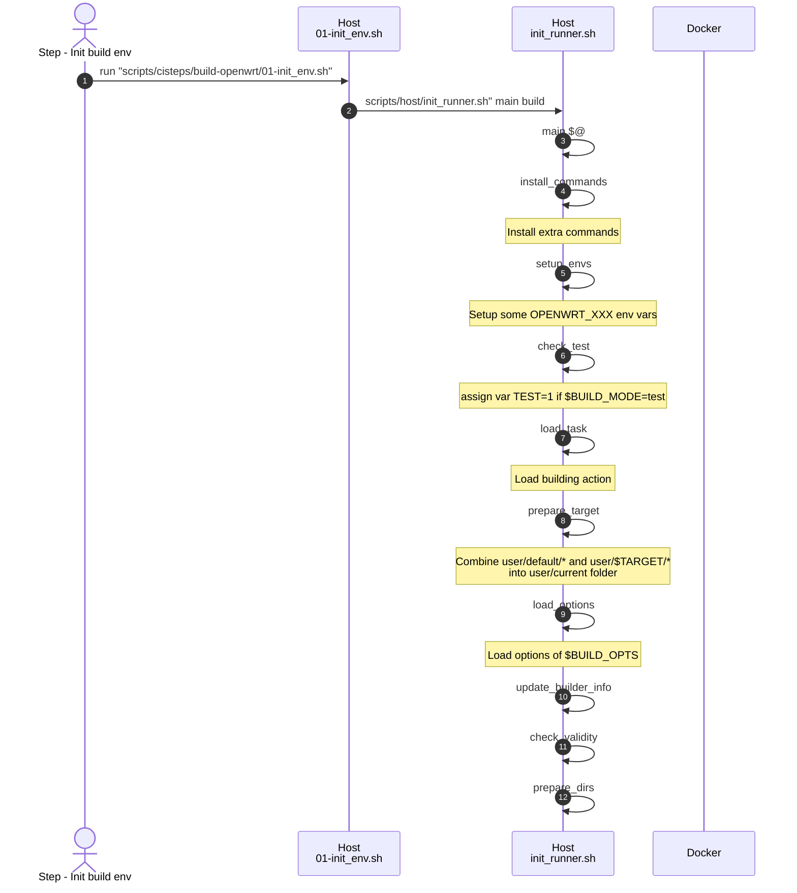
---
<br><br>


### <a id="step02"/>Step - Check if skip this job
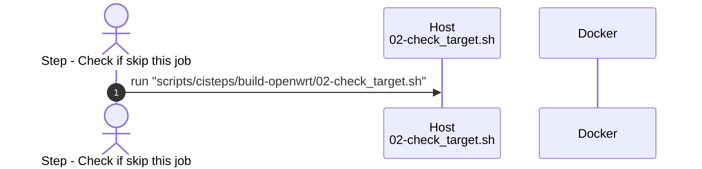
---
<br><br>


### <a id="step03"/>Step - Clean up for extra space if not in TEST mode
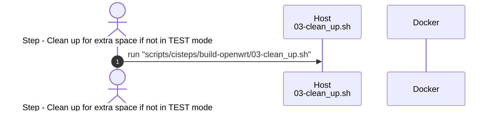
---
<br><br>


### <a id="step03a"/>Step - Set up QEMU
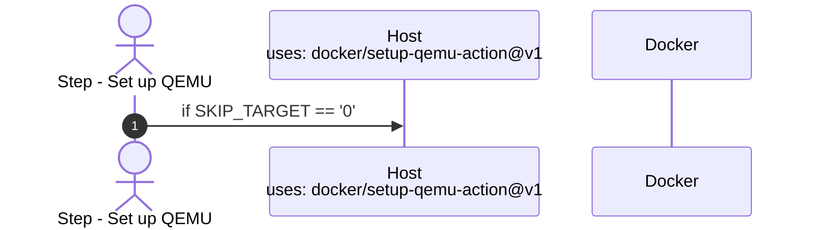
---
<br><br>


### <a id="step03b"/>Step - Set up Docker Buildx
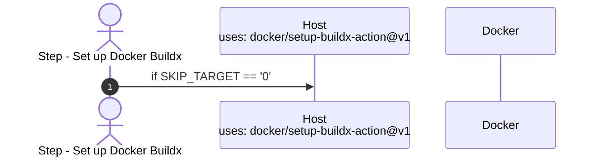
---
<br><br>


### <a id="step04"/>Step - Configure docker
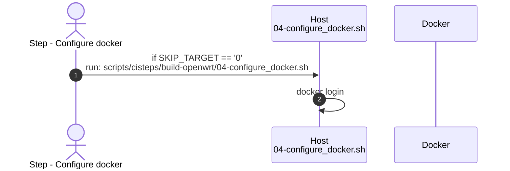
---
<br><br>


### <a id="step05"/>Step - Check status of builders
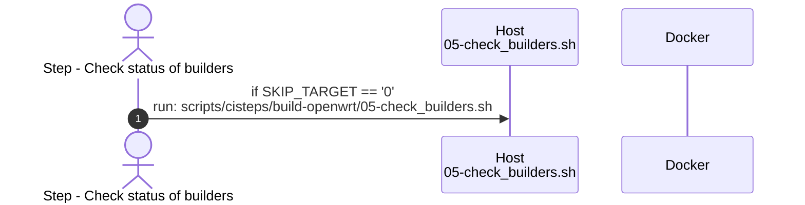

And the flowchart of 05-check_builders.sh is:
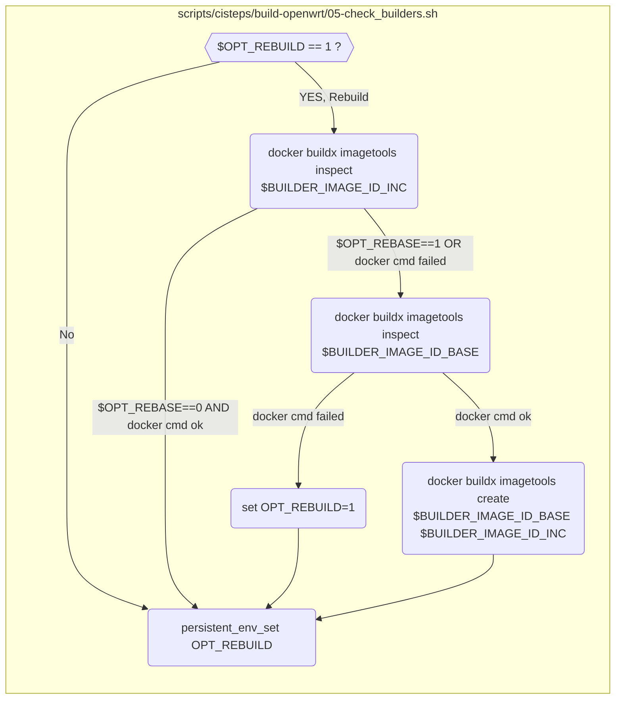
---
<br><br>


### <a id="step05a"/>Step - Wait for SSH
Wait for SSH if  env.SKIP_TARGET == '0' && env.OPT_DEBUG == '1' && env.TEST != '1'
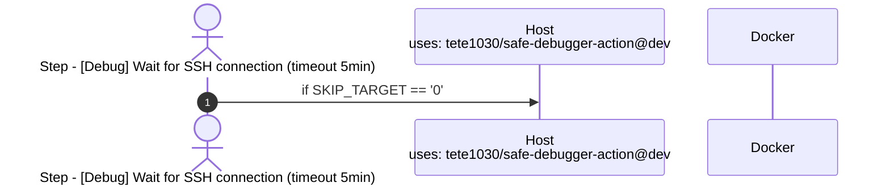
---
<br><br>


### <a id="step06"/>Step - Get Docker Builder Image
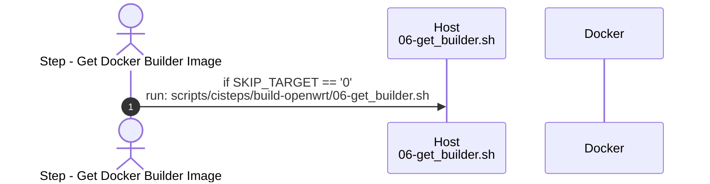

And the flowchart of 06-get_builder.sh is:
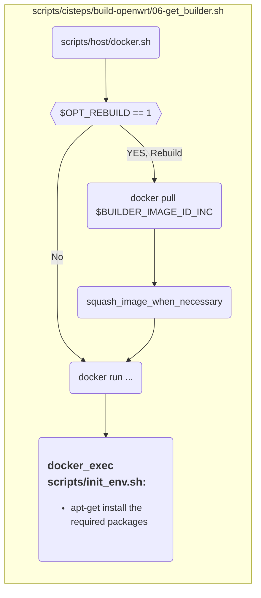
---
<br><br>

### <a id="step07"/>Step - Clone/update OpenWrt
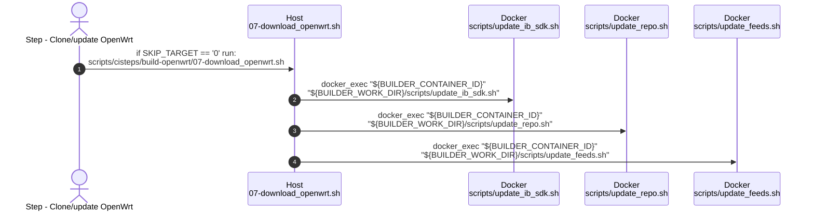

And the flowchart of 07-download_openwrt.sh is:
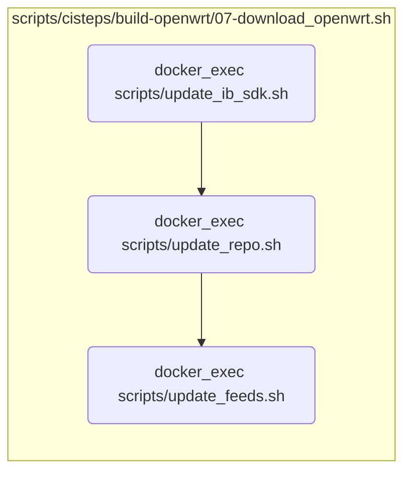
---
<br><br>

### <a id="step08"/>Step - Apply customizations
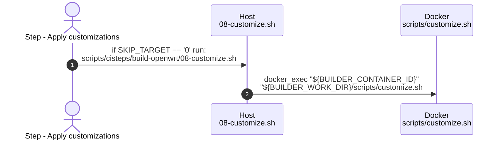

And the flowchart of scripts/customize.sh is:
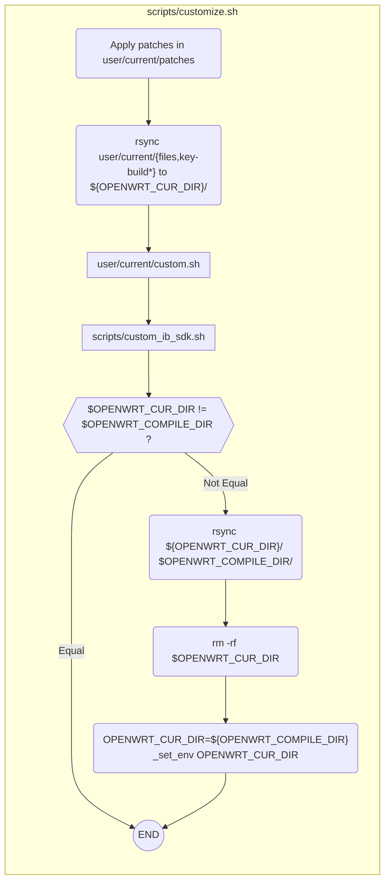
---
<br><br>


### <a id="step08a"/>Step - [Debug/Menuconfig] Wait for SSH connection (timeout 30min)
Wait for SSH if  env.SKIP_TARGET == '0' && env.OPT_DEBUG == '1' && env.TEST != '1'
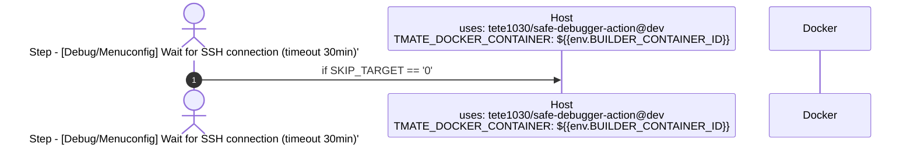
---
<br><br>


### <a id="step09"/>Step - Prepare config file
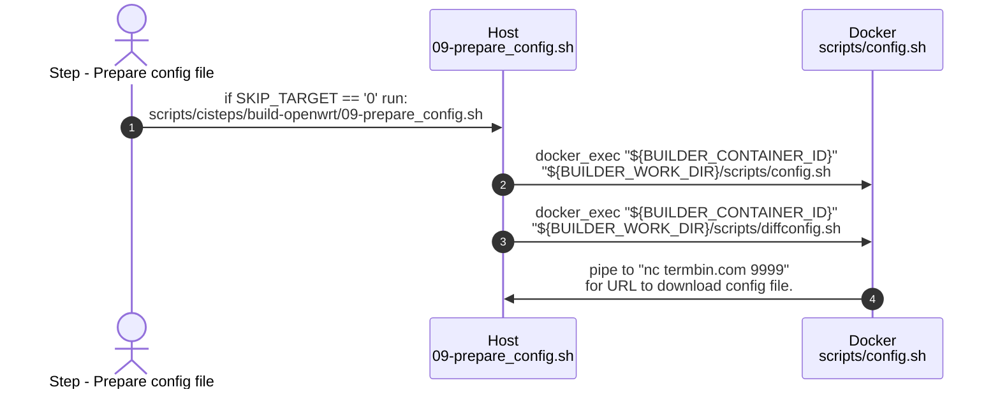

And the flowchart of scripts/config.sh is:
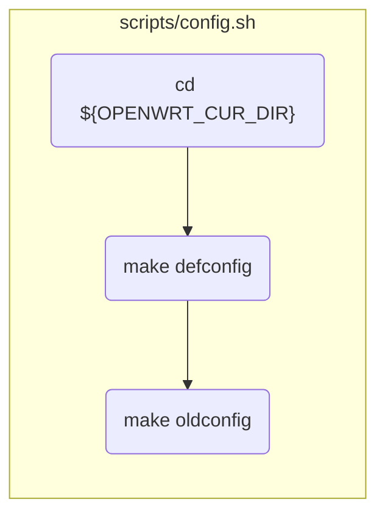
---
<br><br>


### <a id="step12a"/>Step - [Failure/Debug] Wait for SSH connection (timeout 30min)
Wait for SSH if env.SKIP_TARGET == '0' && !cancelled() && (job.status == 'failure' || (env.OPT_DEBUG == '1' && env.TEST != '1'))

---
<br><br>
   

### <a id="step13"/>Step - Upload builder
Upload builder if env.SKIP_TARGET == '0' && !cancelled() && (job.status == 'success' || env.OPT_PUSH_WHEN_FAIL == '1')
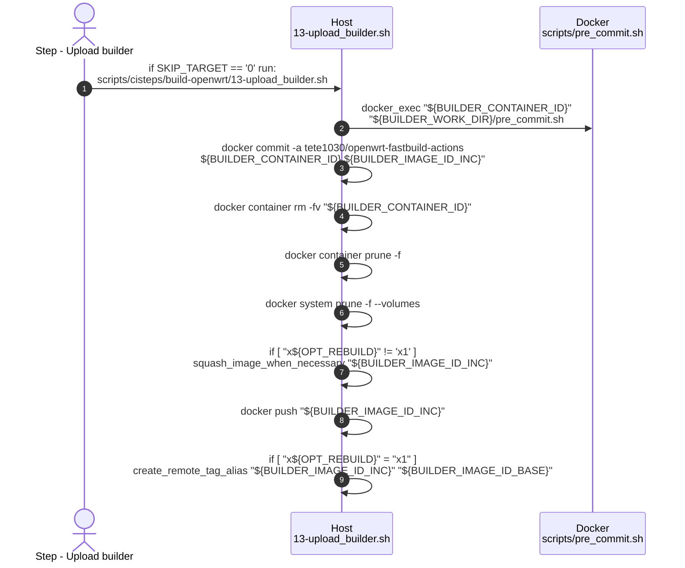

And the flowchart of scripts/pre_commit.sh is:
```mermaid
flowchart TB
  subgraph sub_pre_commit ["scripts/pre_commit.sh"]
    direction TB
    check_source_dir -->|Exists| rm_rf_source

    check_source_dir{{"[ -d ${OPENWRT_SOURCE_DIR} ] ?"}}
    rm_rf_source("rm -rf ${OPENWRT_SOURCE_DIR}")
  end
```
---
<br><br>

  
### <a id="step14"/>Step - Organize files
Organize filesif env.SKIP_TARGET == '0' && !cancelled()
```mermaid
sequenceDiagram
  autonumber
  actor ActionStep as Step - Organize files
  participant Host1 as Host<br>14-organize_files.sh
  participant Docker1 as Docker<br>scripts/pre_commit.sh

  ActionStep ->> Host1: if SKIP_TARGET == '0' run: <br>scripts/cisteps/build-openwrt/14-organize_files.sh
  Host1 ->> Docker1: docker_exec "${BUILDER_CONTAINER_ID}"<br> "${BUILDER_WORK_DIR}/pre_commit.sh
  Host1 ->> Host1: docker commit -a tete1030/openwrt-fastbuild-actions <br> ${BUILDER_CONTAINER_ID} ${BUILDER_IMAGE_ID_INC}"
  Host1 ->> Host1: docker container rm -fv "${BUILDER_CONTAINER_ID}"
  Host1 ->> Host1: docker container prune -f
  Host1 ->> Host1: docker system prune -f --volumes
  Host1 ->> Host1: if [ "x${OPT_REBUILD}" != 'x1' ] <br>  squash_image_when_necessary "${BUILDER_IMAGE_ID_INC}"
  Host1 ->> Host1: docker push "${BUILDER_IMAGE_ID_INC}"
  Host1 ->> Host1: if [ "x${OPT_REBUILD}" = "x1" ] <br> create_remote_tag_alias "${BUILDER_IMAGE_ID_INC}" "${BUILDER_IMAGE_ID_BASE}"
```

And the flowchart of scripts/pre_commit.sh is:
```mermaid
flowchart TB
  subgraph sub_pre_commit ["scripts/pre_commit.sh"]
    direction TB
    check_source_dir -->|Exists| rm_rf_source

    check_source_dir{{"[ -d ${OPENWRT_SOURCE_DIR} ] ?"}}
    rm_rf_source("rm -rf ${OPENWRT_SOURCE_DIR}")
  end
```
---
<br><br>

  
## Directory Hierarchy
```
user                                                                                                 #step01  scripts/host/init_runner.sh
├── default                                 # Default profile settings
│   ├── ib                                  # Files for ImageBuilder                                   
│   │   ├── config.diff                     # Extra options for .config                              #step09  scripts/config.sh
│   │   ├── disabled-services.ssv           # SpaceSeparatedVars for services to be disabed          #step09  scripts/config.sh
│   │   ├── packages.ssv                    # SpaceSeparatedVars for packages to be installed        #step09  scripts/config.sh
│   │   ├── profile.ssv                     # SpaceSeparatedVars for device profile (e.g. xiaomi_mi-router-ax3000t)
│   │   ├── feeds.conf                      # Extra feeds to be added                                #step08  scripts/custom_ib_sdk.sh  update_ib_repositories_conf
│   │   ├── custom.sh                       # Script before make                                     #step08  scripts/custom_ib_sdk.sh
│   │   ├── prepare_rootfs_hook.d           # Hook scripts before IB prepares rootfs                 #step11/12  scripts/compile.sh 
│   │   ├── files                           # Files to be added to ImageBuilder base folder          #step01  used by IB make rules
│   │   │   └── some dirs and files         
│   │   └── patches                         # Patches to be applied to IB                            #step08  scripts/custom_ib_sdk.sh  apply_patches_for_ib
│   │       └── *.patch
│   ├── sdk
│   │   ├── config.diff                     # Extra options for .config                              #step09  scripts/config.sh 
│   │   ├── feeds.conf                      # Extra feeds to be added                                #step08  scripts/custom_ib_sdk.sh  generate_sdk_feeds_conf 
│   │   ├── custom.sh                       # Script for customization (before config)               #step08  scripts/custom_ib_sdk.sh
│   │   ├── files                           # Files to be added to SDK                               #step01  used by SDK make rules
│   |   │   └── package                     # Files to be added to SDK/package/
│   │   │       └── some dirs and files         
│   │   └── patches                         # Patches to be applied to SDK                           #step08  scripts/custom_ib_sdk.sh  apply_patches_for_sdk
│   │       └── *.patch
│   └── source
│       ├── config.diff                     # Extra options for .config                              #step08  scripts/customize.sh
│       ├── feeds.conf                      # Extra feeds to be added                                #step07  scripts/update_feeds.sh  generate_source_feeds_conf
│       ├── packages.txt                    # Extra for packages to be added                         #step07  scripts/update_feeds.sh
│       ├── custom.sh                       # Script for customization (before config)               #step08  scripts/customize.sh
│       ├── files                           # Files to be added to Git Source                        #step01  used by Source make rules
│       │   └── package                     # Files to be added to SOURCE/package/
│       │       └── some dirs and files       
│       └── patches                         # Patches to be applied to Git Source                    #step08  scripts/customize.sh
│           └── *.patch
├── target1                                 # First target
│   ├── settings.ini                        # Settings                                               #step01  scripts/host/init_runner.sh
|   └── ...                                 # SAME HIERACHY AS user/default
└── target2                                 # Second target
│   ├── settings.ini                        # Settings                                               #step01  scripts/host/init_runner.sh
|   └── ...                                 # SAME HIERACHY AS user/default
└── targetN ...                             # More targets

```

In #step01 (scripts/host/init_runner.sh) will combine user/default and user/$BUILD_TARGET into user/current.

## Directories
```
BUILDER_WORK_DIR="/home/builder"
BUILDER_TMP_DIR="/tmp/builder"
HOST_TMP_DIR="/tmp/builder"
HOST_BIN_DIR="/home/builder/openwrt_bin"
HOST_WORK_DIR=${{github.workspace}}
BUILDER_BIN_DIR="${BUILDER_WORK_DIR}/openwrt_bin"      --> /home/builder/openwrt_bin
BUILDER_PROFILE_DIR="${BUILDER_WORK_DIR}/user/current" --> /home/builder/user/current
OPENWRT_COMPILE_DIR="${BUILDER_WORK_DIR}/openwrt"      -->  /home/builder/openwrt
OPENWRT_SOURCE_DIR="${BUILDER_TMP_DIR}/openwrt"        -->  /tmp/builder/openwrt

OPENWRT_CUR_DIR is Where Office OpenWRT GIT is cloned, which could be
  OPENWRT_CUR_DIR="${OPENWRT_SOURCE_DIR}"               -->  /tmp/builder/openwrt
  OPENWRT_CUR_DIR="${OPENWRT_COMPILE_DIR}"              -->  /home/builder/openwrt  (Fresh build)

KOUHJ_SRC_DIR="${BUILDER_WORK_DIR}/kouhj_src"          --> /home/builder/kouhj_src  (gh repo clone kouhj/kouhj_openwrt_packages)

MY_DOWNLOAD_DIR="${BUILDER_WORK_DIR}/kbuilder/download"         -->  /home/builder/kbuilder/download    (Where IB & SDK are downloaded)
OPENWRT_MF_FILE="${MY_DOWNLOAD_DIR}/${MF_FILE}"                    -->  /home/builder/kbuilder/download/openwrt-XXX-XXX.manifest
OPENWRT_IB_DIR="${MY_DOWNLOAD_DIR}/${OPENWRT_IB_FILE%.tar.xz}"     -->  /home/builder/kbuilder/download/openwrt-imagebuilder-XXX.Linux-x86_64
OPENWRT_SDK_DIR="${MY_DOWNLOAD_DIR}/${OPENWRT_SDK_FILE%.tar.xz}"   -->  /home/builder/kbuilder/download/openwrt-sdk-XXX_gcc-X.X.X_musl.Linux-x86_64

```

Docker Directory Mappings:
| Host Directory                                      | Docker Directory                                       |
| --------------------------------------------------- | ------------------------------------------------------ |
| ${HOST_WORK_DIR}/                                   | ${BUILDER_WORK_DIR}/                                   |
|  /home/runner/work/openwrt_builder/openwrt_builder/ |  /home/builder/                                        |
| ${HOST_WORK_DIR}/kbuilder                           | ${BUILDER_WORK_DIR}/kbuilder  (/home/builder/scripts)  |
| ${HOST_WORK_DIR}/kouhj_src                          | ${BUILDER_WORK_DIR}/kouhj_src  (/home/builder/scripts) |
| ${HOST_WORK_DIR}/scripts                            | ${BUILDER_WORK_DIR}/scripts  (/home/builder/scripts)   |
| ${HOST_WORK_DIR}/user                               | ${BUILDER_WORK_DIR}/user   (/home/builder/user)        |
| ${HOST_BIN_DIR} (/home/builder/openwrt_bin)         | ${BUILDER_BIN_DIR}  (/home/builder/openwrt_bin)        |
| ${HOST_TMP_DIR} (/tmp/builder)                      | ${BUILDER_TMP_DIR}  (/tmp/builder)                     |
| ${GITHUB_ENV}                                       | ${GITHUB_ENV}                                          |


## Supported Devices

This repository currently supports the following device targets:

| Target Name | Device | Target Board | Subtarget | Architecture | Profile |
|-------------|--------|--------------|-----------|--------------|---------|
| x64 | Generic x86_64 | x86 | 64 | x86_64 | - |
| ax6s | Xiaomi Redmi Router AX6S | mediatek | mt7622 | aarch64_cortex-a53 | xiaomi_redmi-router-ax6s |
| ax3000t | Xiaomi Mi Router AX3000T | mediatek | mt7981 | aarch64_cortex-a53 | xiaomi_mi-router-ax3000t |
| cr6609 | Xiaomi Mi Router CR6609 | ramips | mt7621 | mipsel_24kc | xiaomi_mi-router-cr6609 |

To add a new target, create a directory under `user/<target_name>/` with the same structure as existing targets and update the workflow file.
